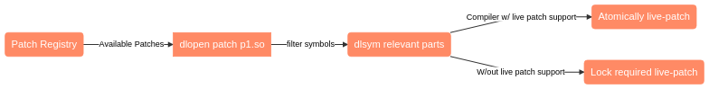

# Live Patching Demonstration

Hot patching, also known as live patching or dynamic software updating, is the application of patches without
shutting down and restarting the system or the program concerned.
This addresses problems related to unavailability of service provided by the system or the program.

There are trivial solutions for certain kinds of applications to archive zero-downtime as described in the next section. 
A more involved way of hot-patching rewrites instructions in hot / loaded memory pages.

This repository contains a proof of concept implementation of a library targeting C ABI and C++ (Italium) ABI that
favours the idea of a binary patch repository / registry.
Read on for a bit of a context or skip right to the [Function patching](#function-patching) section.

Table of Contents
=================

* About hot-patching
  * [Zero-downtime full replacement](#zero-downtime-full-replacement)
  * [dlopen patching](#dlopen-patching)
  * [Function patching](#function-patching)
    * [OS, compiler and machine dependant](#os-compiler-and-machine-dependant)
    * [Notes on C   specifics](#notes-on-c-specifics)
    * [Compiler optimizations](#compiler-optimizations)
 * [About this library](#about-this-library)
* [How to use](#how-to-use)
* [Build](#build)
* [Tests and Documentation](#tests-and-documentation)
* [License](#license)


### Zero-downtime full replacement
The probably most safe live-patching method is to embed support for a "soft" restart, so replacing the entire
application without downtime.
An external signal (might literally be a [unix] *signal* like USR1) notifies the binary to start the newer version
which waits for a resource (file descriptors) handover.
That handover might happen via a unix domain socket and an SCM_RIGHTS type of message (see http://man7.org/linux/man-pages/man3/cmsg.3.html).
This is also known as socket migration which [B. Kuntz and K. Rajan](https://www.cs.cmu.edu/~softagents/migsock/MIGSOCK.pdf)
provide an in-deep overview of.

Example: Let's imagine our process is a web server. The current version will finish serving the open requests and shuts down when done.
While the new version got the socket handler for incoming requests and will already start to serve new requests.

This trivia patching method is not handled in this repository.

### dlopen patching

If an application is designed in a way that all functionality is loaded at runtime via dynamic libraries,
it is a no-brainer to [`dlopen`](https://linux.die.net/man/3/dlopen) a new variant of a library and swap
function pointers with the newly loaded symbols.

This is also a trivial method and is thread safe, because pointer swapping happens atomically.
(This is not thread safe if multiple methods need to be replaced and patches have mutable dependencies.)

The next patching method is able to hot patch statically linked code, but uses `dlopen` internally as well. 

### Function patching

Function patching rewrites executable memory pages. If no compiler support for function padding is available,
the first few instructions of the to-be-patched method are overwritten with an unconditional jump instruction.
The 32bit offset jump instruction is five bytes in length, the 64bit offset `jmp` instruction is 14 bytes in length.
This minimal length imposes the same same minimal length for our target method.

```asm
EB cb	JMP rel8	Jump short, relative, displacement relative to next instruction.
E9 cw	JMP rel16	Jump near, relative, displacement relative to next instruction.
E9 cd	JMP rel32	Jump near, relative, displacement relative to next instruction.
```

If that precondition is not hold or the function signature differs, a live-patch cannot be performed.

**Runtime implications:**
The trade-off of security / stability through patchable methods vs runtime speed has to be considered.  
This method adds an indirection and enforces inlining to be off for patchable functions.

#### OS, compiler and machine dependant
This patching method is machine specific and also operating system specific.

* The method used here is tailored for Linux and x86-64.

* Compiler may support hot-patching like the Microsoft VS compiler. It prepends functions with 5 bytes of NOPs
(No Operation) and the first instruction of a function is a `mov edi, edi` instruction (2 bytes NO OP). 
x86 is a variable length instruction set. The first two NO-OP bytes can be replaced by a [short 2-byte relative jump](https://thestarman.pcministry.com/asm/2bytejumps.htm),
bringing us into the 5 bytes of NOP section where a full unconditional jump can be used.

G++ does not have a similar support so far and without further care we do destroy the first part of the original function
and the write cannot be performed atomic because it consists of 5 bytes. Atomic writes would either be a byte, a word or a dword.

* Operating systems usually load executable code (the .text section of the binary) into read-only memory pages.
For patching those memory pages, operating system specific syscalls must be performed.
On linux this is [`mprotect`][2].

[1]: https://thestarman.pcministry.com/asm/2bytejumps.htm
[2]: http://man7.org/linux/man-pages/man2/mprotect.2.html

#### Notes on C++ specifics

Patching a C++ class method is not that different to a C function patch.
The calling convention need to be known, which is usually [`thiscall`][3]:
The caller cleans the stack (no work for our patched function), parameters are pushed right-to-left to the stack.
The `this` pointer is assigned to the ECX register. 

In contrast to C, C++ does not have a standardized ABI though. Name mangling is different across different compilers.
Compilers have the freedom of laying out the virtual table however they want and yes, the calling convention can be different
as well. The implemented virtual function patch is g++ specific.

If a binary is target that has been compiled with different compiler flags or a different compiler, this
library will **certainly crash** or rather cause **undefined behaviour**.

[3]: https://gcc.gnu.org/onlinedocs/gcc/x86-Function-Attributes.html

#### Compiler optimizations 

Compilers will usually eagerly inline if `-O` != 0 (any release build) which would break our live-patching mechanism.
The library provides a `FORCE_NO_INLINE` macro that must be used in front of each live-patchable method.
**Note**: Forcing no-inline is not standardized yet and might not work on all compilers.  

Additionally the demo application adds the `-flive-patching=inline-only-static` [compiler flag][1] on g++ 9.1 and newer.

[1]: https://gcc.gnu.org/git/?p=gcc.git;a=commitdiff;h=126dab7c9d84294f256b1f7bf91c24a9e7103249

### About this library 

Organisational:
This repository is split into a demonstration application and the patching library itself.
When build, the build system will also already compile the demonstrational patches. 

How does it work:



1. The patching library will, on request, contact a patch registry (which happens to be the `registry/meta.json` file in this repo)
to retrieve meta information about new available patches. There are of course patches available.

2. Because binary blobs downloaded off the internet is not the best of ideas, this repo does not contain pre-build x86 patches
   but build-system compiled ones. Those patches are object files, linked into dynamically linked libraries.

3. The registry meta information contains the functions mangled name (symbol name).<br>
   Note: In theory the object file could be used directly, but to save us from aligning functions, patching addresses (for `-fpic` compiled code),
   initializing global variables and all that jazz that the operating systems loader already does for us, `dlopen` and `dlsym` are used. 

4. `dlsym` has provided us with the functions address.
   The affected memory page of the to-be-replaced function is made writable and the first few instructions of that function
   are replaced with an unconditional jump to the `dlsym` provided address. This works for C and C++ non-member as well as
   member functions.
   
5. For virtual member functions, the objects vtable is patched instead.

Patches are only applied if the integer based version of a patch is higher than a potentially already patched function version.
To make this work, those version numbers are stored in the P_TABLE.

Disclaimer: In contrast to a real-world scenario, the demo application patches itself and keeps a list of patchable function addresses in memory (`P_TABLE`).
That simplifies this demonstration:

* Because no privileged access rights need to be granted to change non-process-owned memory pages.
* It is assumed that any other user-space patchable binary is also either instrumented or accompanied by a static symbol address table.
  Because of Address space layout randomization which is enabled by default, the later option is of no use however.

## How to use

There is no command line interface, but the app accepts key inputs.

* "u": Press u to just update the registry cache.
* "p": Press p to patch functions to their newest versions.
       If the registry cache is too old, it will be refreshed first.

After patching the stdout output should change like in this excerpt:

```shell script
Press u for updating the registry. Press p for patching. Press c for canceling.
Current working dir: /home/david/CLionProjects/runtime-patching

Hello, from C++ member function! 42
Hello, from C function! 42

> p
  Patching now
  Patching _ZN9DemoClass9say_helloEiSt17basic_string_viewIcSt11char_traitsIcEE to 1
  Patched _ZN9DemoClass9say_helloEiSt17basic_string_viewIcSt11char_traitsIcEE to 1
  Patching _Z13say_hello_funiSt17basic_string_viewIcSt11char_traitsIcEE to 1
  Patched _Z13say_hello_funiSt17basic_string_viewIcSt11char_traitsIcEE to 1

Completely patched! from C++ member function! 42
Completely patched! from C function! 42

```

Security frameworks and techniques like seccomp, SELinux and Apparmor might prevent the required `mprotect` kernel call
in which case the application gracefully crashes.

## Build

The buildsystem is cmake. This repository is almost self-contained with the exception of the test framework.
All external libraries are provided in `vendor` directories and are BSD or MIT licensed.

Run `mkdir build && cd build` and `cmake ../ && cmake --build .` to build the project.
You need a compiler that supports C++17.

## Tests and Documentation

Use `cmake test` on the command line to start the test suite.
Google Test is used and will be downloaded and compiled if the libraries are not available in PATH.

The library is documented in a Doxygen compatible format.
If doxygen is installed, use `cmake --build . --target doc` in the build directory.

## Limitations

* Right now this library only adds patches (`dlopen`), but never removes (`dlclose`) non used ones.
  Either dlopens own reference count could be used (so that for each `Patch` destructor `dlclose` is called)
  or a DlOpen RAII shared pointer class is created. 
* The registry is a proof-of-concept local file, no checksum, no auth implementation

## License

MIT

David Gräff - 2019